# 🏗️ Pipeline Diagrams & Visual Representations

## 📊 CI/CD Pipeline Architecture

### 🔄 Main Pipeline Flow
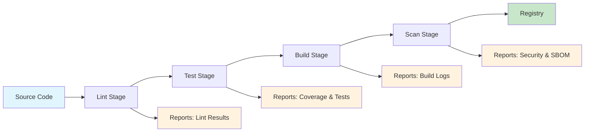

### 🔍 Lint Stage Detail
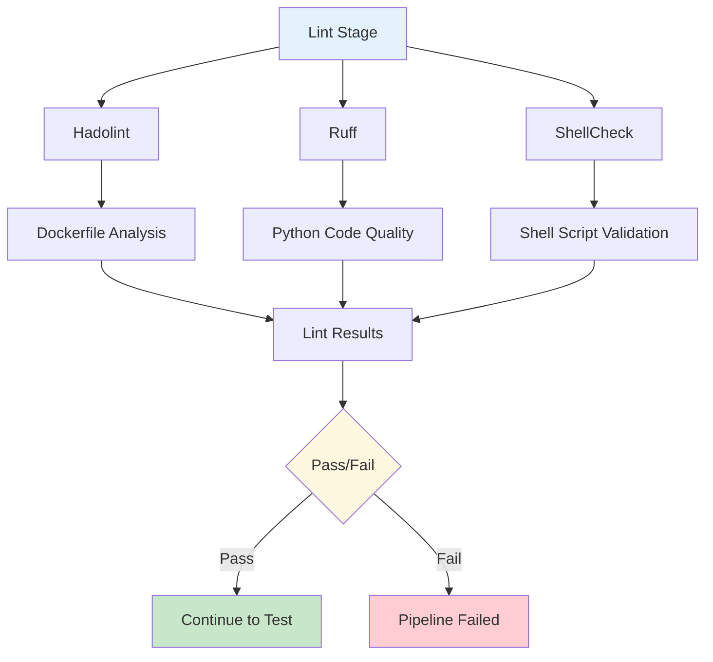

### 🧪 Test Stage Detail
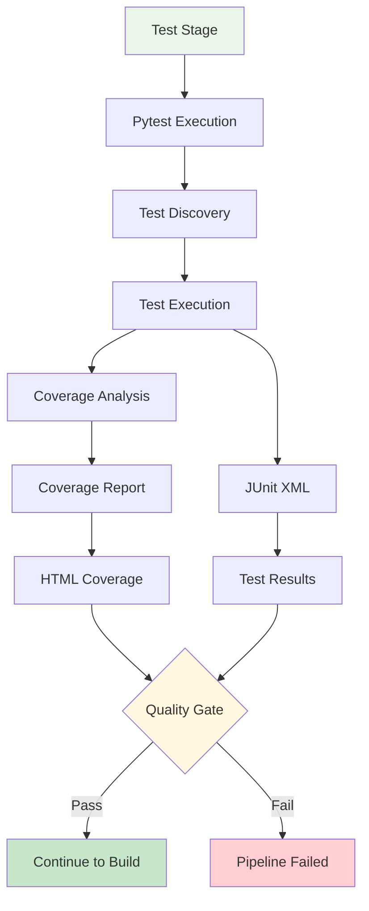

### 🏗️ Build Stage Detail
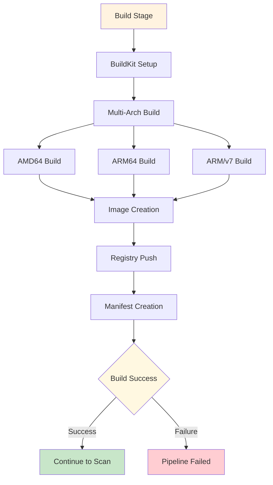

### 🔒 Scan Stage Detail
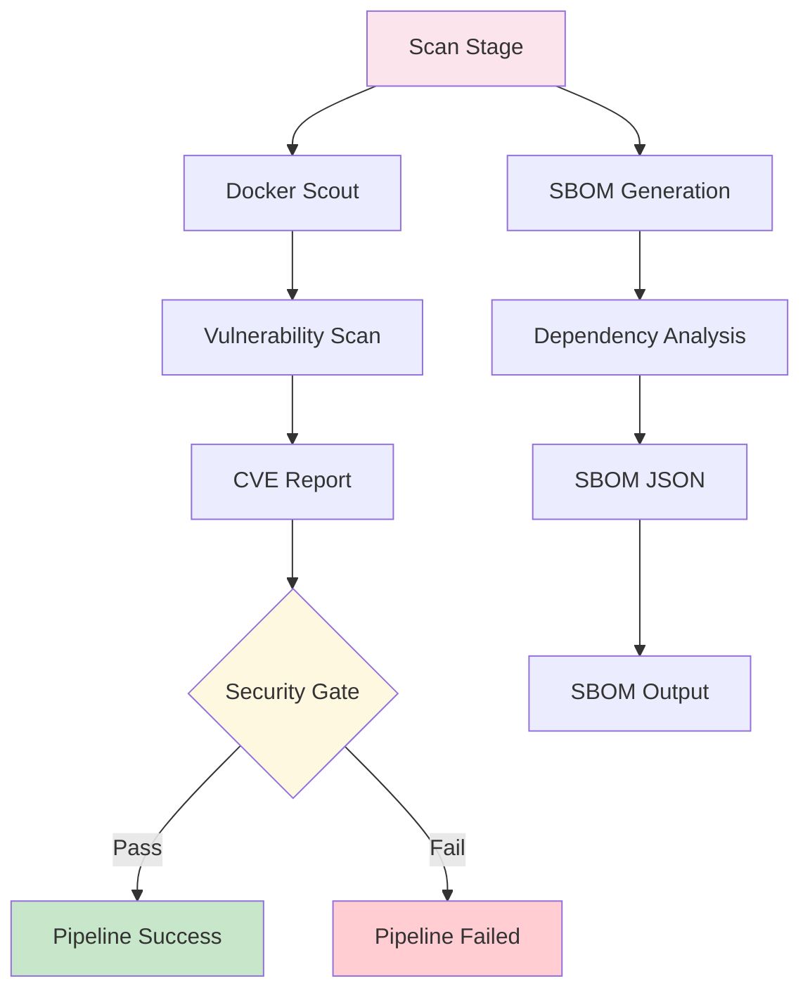

## 🔄 Data Flow Diagram

### 📊 Complete Data Flow
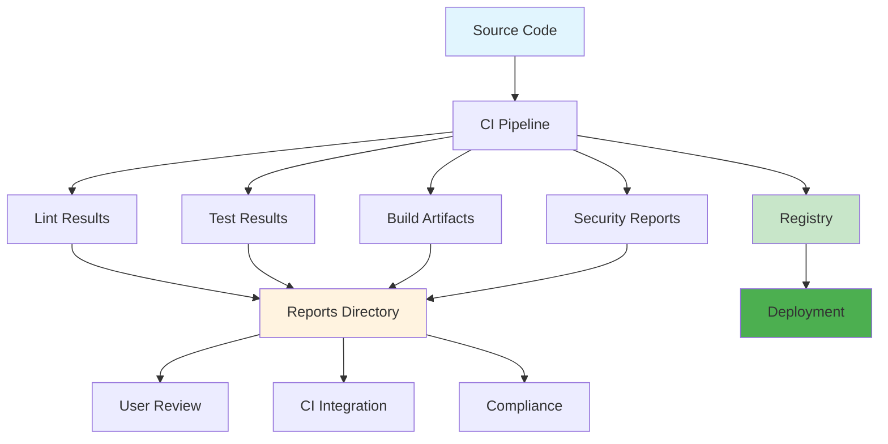

## 🏗️ Infrastructure Architecture

### 🐳 Docker Services Architecture
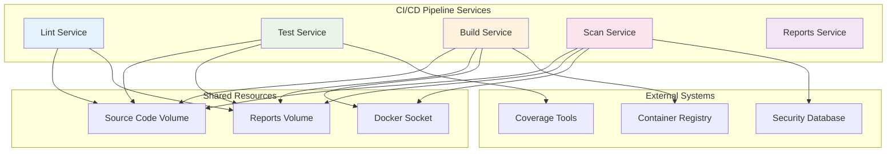

## 🔄 Pipeline Execution States

### 📈 Pipeline State Machine
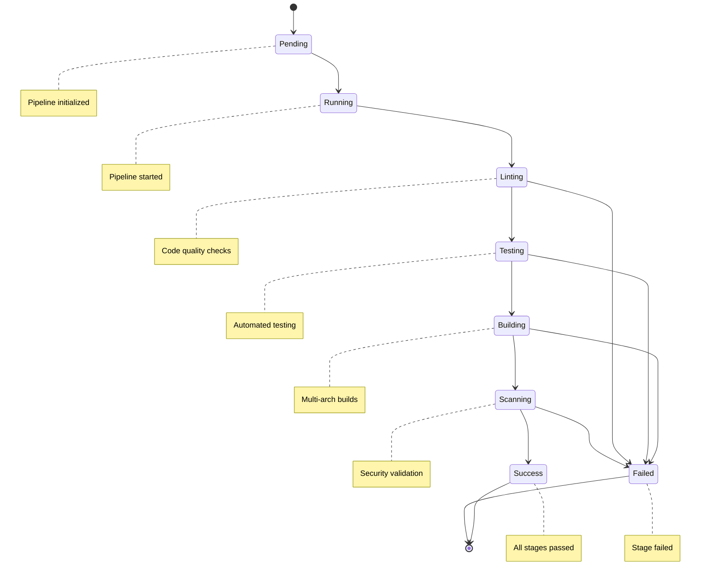

## 📊 Performance Metrics

### ⏱️ Pipeline Performance Timeline
```mermaid
gantt
    title CI/CD Pipeline Performance Timeline
    dateFormat  X
    axisFormat %s
    
    section Pipeline Stages
    Lint Stage     :lint, 0, 30s
    Test Stage     :test, after lint, 60s
    Build Stage    :build, after test, 300s
    Scan Stage     :scan, after build, 90s
    
    section Quality Gates
    Lint Check     :lint_check, 0, 30s
    Test Validation:test_val, after lint, 60s
    Build Success  :build_success, after test, 300s
    Security Pass  :security_pass, after build, 90s
```

## 🔒 Security Architecture

### 🛡️ Security Scanning Flow
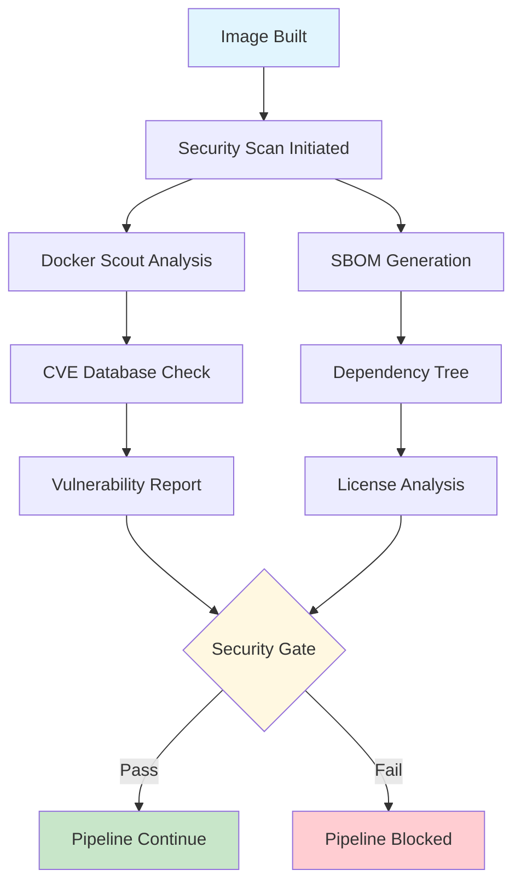

## 📱 User Experience Flow

### 👤 User Journey Map
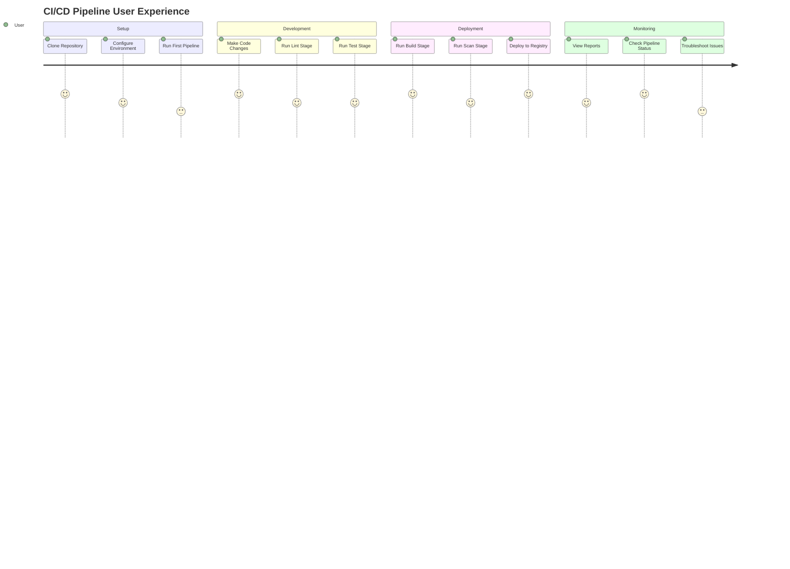

## 🔧 Configuration Management

### ⚙️ Environment Configuration
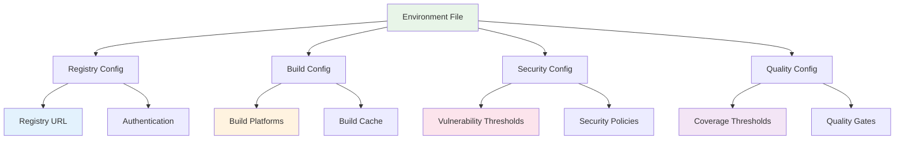

## 📊 Monitoring & Observability

### 📈 Pipeline Metrics Dashboard
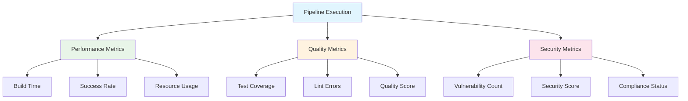

---

## 🎯 Diagram Usage

### 📱 Viewing Diagrams
These diagrams are written in Mermaid syntax and can be viewed in:
- **GitHub**: Native Mermaid support in markdown
- **GitLab**: Native Mermaid support in markdown
- **VS Code**: Mermaid extension
- **Online**: Mermaid Live Editor

### 🔧 Customization
To modify these diagrams:
1. Edit the Mermaid code blocks
2. Update the diagram content
3. Test in Mermaid Live Editor
4. Commit changes to repository

### 📊 Integration
These diagrams can be integrated into:
- **README.md**: For project overview
- **Documentation**: For detailed explanations
- **Presentations**: For stakeholder communication
- **Training**: For team onboarding

---

**Status**: ✅ **Pipeline Diagrams Complete**  
**Created**: Today  
**Next Review**: After team validation  
**Success**: Visual representation complete! 🎯**